# 第四章 调车工作

## 【本章导读】

本章首先讲述调车作业的基本概念，然后讲述调车工作的基本因素及作业时间标准，随后介绍牵出线和驼峰调车作业方法。本章的最后一节讲述调车作业计划的编制，为本章的重点。

## 【学习目标】

(1)理解调车工作的分类及领导、指挥组织方法;

(2)了解调车工作的基本要求；

(3)掌握驼峰解体的作业程序；

(4)掌握驼峰作业方案及其适用条件；

(5)掌握按站顺编组摘挂列车时调车作业计划的编制方法。

## 【重点及难点】

(1)牵出线调车作业方法；

(2)驼峰调车作业方法；

(3) 调车作业计划的编制。

## 第一节 调车的概念

## 一、调车的含义

铁路运输过程中的机车车辆的运行调移可分为两大类:凡是跨站点的运行为“列车运行工作”，属于路网层面的行车组织工作，其最小移动实体是 “列车”，其中包括组织运行的单机、 轨道车等非常规列车，对之赋予列车车次号，利用“列车运行图”组织运行；凡在车站范围内或超出该范围但未进入另一站的调移为 “调车工作”，属于站点层面的行车组织工作，其最小移动实体可以是 “车列”，也可以是细化后的 “车组” “车辆” 等，通常以机车为动力，当然也包括单机调移, 它们因不跨站点运行而无须冠以车次号, 利用 “调车作业通知单” 组织调车工作。 调车工作也可简称为 “调车”。

简言之, 除列车在车站到达、出发、通过以及在区间运行外, 凡机车车辆所进行的一切有目的的移动统称为调车。

列车运行工作与调车工作既相互区别又相互服务、互为前提, 其配合性是顺利完成运输任务的重要前提。由于列车运行事关路网全局性运行秩序, 调车工作属于站点局部性生产安排, 故调车工作应服从于列车运行工作，列车运行工作在形成决策时应考虑有关站点完成调车工作的可行性。

调车工作包括编制调车作业计划的决策过程和执行调车作业计划的作业过程。其中调车决策受车站整体性工作计划 (车站班计划, 尤其是当前阶段计划) 的指导和约束, 属于面对调车班组的作业性决策，是本章侧重论述的内容。

影响调车决策的因素很多, 除了待解编车列的组号构成和车组分布之外, 还要考虑用线条件 (如用线数、线路容车数等)、调车作业端、允许作业时间、相关作业环节的衔接配合以及合理选编目标的确定等，而且这些影响因素都是可变的。

## 二、调车的作用

调车工作是车站工作组织中一项重要而又复杂的工作内容, 在技术站尤其是在编组站, 它更是主要的生产活动, 处于中心环节地位。车站能否按时接发列车, 能否快捷合理地完成装卸、 取送、选编等作业，能否有效利用设备能力并最终完成生产计划指标，在很大程度上都取决于调车的决策水平和作业质量。安全高效地完成调车工作，对于保证运输安全、加速车辆周转、 降低运输成本、增加运输能力、满足运输需求都起着十分重要的作用。

## 三、调车的分类

调车工作可分为以下几种:

(1)解体调车——将待解车列按重车的去向(到站)及空车车种分解到指定的线路上。

(2)编组调车——按《技规》和列车编组计划的要求，将相应的车组(车辆)选编成车列。

(3)摘挂调车——对列车摘减车组(减轴)、加挂车组(补轴)、换挂车组或摘挂车组。

(4)取送调车——为货物装卸及车辆检修，向相应作业地点送车或取车。

(5)其他调车——如车列或车组转场、重车检斤、整理车场存车及在站线上放行机车等。

需要说明的是, 以上是对调车工作的传统分类。由于调车工作的复杂性, 对其分类还有其他不同的方式。传统的分类方法有利于区别不同调车机车 (调机) 的分工、体现各调车区的主要功能。例如, 通常指定驼峰调机负责解体调车, 峰尾调机负责编组调车, 还有的调机可负责或兼顾取送调车等；对于摘挂调车通常指定邻近调机兼顾进行，在中间站一般由本务机完成； 而其他调车通常是调机 (或本务机) 为实现其主要功能而发生的附带性调移行为, 一般不指定调机专门进行。

调机之间既有分工也有配合，即使某台调机只纯粹完成自身分担的任务，也并不意味着它只限于完成相应调车类别所规定的上述作业内容, 即各类调车在实际工作中并不能截然分开。

## 四、对调车工作的要求

## (一)基本要求

(1)遵照列车运行计划的安排，与本站列车到发环节紧密配合，及时解体、编组列车，保证本站始发列车正点、满轴、不违编出发，保持到发线路的畅通，避免干扰路网运行秩序，消除危及行车安全的隐患。

(2)依据车站班计划和阶段计划的安排，及时完成选编、取送作业，向货物装卸和车辆检修等相关作业环节提供良好的调车服务，为这些相关作业环节保持生产的便捷性、均衡性和安全性创造有利条件。

(3)优化调车作业计划，有效利用调车设备，提高调车效率，力争以最少的时间和最低的成本完成调车任务。

(4)确保调车作业自身的安全，为此，应加强对调车人员的教育培训工作和督察管理工作。

为了实现上述要求，调车工作必须遵守《技规》《站细》及其他有关规定，建立健全各项必要的工作制度。

## (二)统一领导，单一指挥

调车工作必须实行统一领导和单一指挥，这对协同步调、保证安全和提高效率有重要作用。 全站的调车工作由车站调度员 ( 未设站调时由车站值班员 ) 统一领导。大站内各车场或调车区的调车工作，根据站调布置的任务由该场(区)的调车区长领导。每个调车组在调车长的统一指挥下完成调车作业，即调车计划的接受和传达、作业方法的确定、人员的分工安排以及对调机的行动指挥等均由调车长统一负责。在中间站利用本务机调车时，可由车站值班员、助理值班员或运转车长担任领导指挥工作。

编组站调车工作的领导、指挥组织系统如图 4.1 所示。

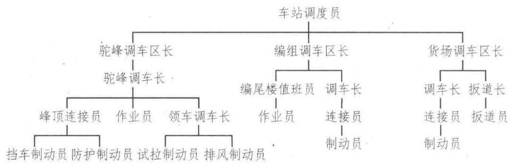

图 4.1 车站调车工作领导、指挥系统

为便于掌握作业规律，保持良好的作业秩序，调车一般应固定区域作业。

调车工作应按规定的技术作业过程和作业计划进行，车站班计划规定了本班时间范围内的全部调车工作任务。在此基础上, 站调再根据生产实际和作业进度调整制订阶段计划, 并分阶段布置调车任务。按阶段计划的要求，调车区长或计划助理调度员制订调车作业计划(调车作业通知单)。当车站规模不大时, 站调也可直接制订调车作业计划, 这有利于更全面地考虑各单项调车工作的合理性, 并增加了调整决策的机动灵活性。调车作业通知单下达给调车组实施，它是调车长组织指挥和全组人员协同行动的依据。

## (三)调车工作“九固定”

为使参加调车作业的人员在作业中相互协调、紧密配合，以及熟悉调车技术设备及工具的性能，便于及时操作和使用，调车工作要实行“九固定”，即固定作业区域、线路使用、调车机车、人员、班次、交接班时间、交接班地点、工具数量及其存放地点。

## 1. 固定作业区域

在调车作业繁忙、配线较多的车站，配有两台或两台以上调车机车时，应根据车站作业特点、设备情况以及调车作业性质，划分每台调车机的固定作业区域，以避免各调车机车作业相互干扰，并有利于作业人员熟悉本区作业性质和设备状况，掌握作业区调车工作的规律，避免在作业中发生冲撞等事故。

## 2. 固定线路使用

结合车站线路配置及车流情况, 要固定车站调车场每一条线路的用途, 以有效地使用线路, 减少重复作业, 缩短调车行程, 提高调车效率。技术站的调车线应按车站调车工作任务要求、 编组计划去向、车流性质、车流量大小等, 结合线路配置及有效长等确定。

## 3. 固定调车机车

为便于调车工作, 要求调车机车起、停快, 前后瞭望条件好, 能顺利通过半径较小的曲线。 因而，调车用的机车要车身短、轴距小，前后均有头灯、防滑踏板、扶手把等。担当调车作业的机车应固定使用，以便了解机车性能，掌握调车技术。作为固定替换用的调车机车及小运转机车亦应符合调车机车的条件。

## 4. 固定人员

调车作业是由多工种配合进行的，包括调车组人员、调车机车的乘务人员和扳道人员等。由于单位不同、工种不同，他们只有长期固定在一起工作，才能相互了解、密切配合、协调作业。

## 5. 固定班次

调车机车的乘务人员和其他调车作业人员分别归机务部门和车站管理。为避免因单位不同导致班次编排不同，要固定班次，真正做到所有参与调车作业的人员长期固定在一起工作。

## 6. 固定交接班时间

固定交接班时间，可以避免交接班人员相互等待，有利于缩短非生产时间，提高作业效率。

## 7. 固定交接班地点

交接班时调车机车停放地点及有关人员交接地点固定后，不仅有利于建立良好的作业秩序, 而且还可以防止因交接不清影响作业安全。

## 8. 固定工具数量

配备足够数量和质量良好的调车工具和备品, 是做好调车工作的物质保证。固定工具数量可随时发现工具数量不足, 及时得到补充。

## 9. 固定工具存放地点

调车工具如铁鞋、鞋叉、信号旗 (灯)、无线调车灯显设备等要固定地点存放，这样不仅有利于及时取用，而且便于清查和保管。

中间站一般没有固定调车机车，由本务机担负调车作业，完全按上述要求进行不具备条件。 但中间站也应按上述要求，尽量做到人员和工具的固定，以协调作业、提高效率、保证安全。

## 第二节 调车的基本因素及作业时间标准

为科学组织调车工作、合理评价调车决策水平及客观体现作业人员的劳动贡献等，需要采用调车作业量和调车作业时间标准等衡量指标。由于调车工作的复杂性, 在解编等量列车或车辆的条件下, 不同的车流构成、设备条件以及调车决策等都会造成调车作业量和调车作业时间的较大差别。引入 “调车钩” 和 “调车程” 的概念有利于对调车作业量、调车作业时间等进行相对精确的计算, 也便于描述调车作业过程。

## 一、调车钩

调车作业计划是以调车钩为基本单位对作业做出安排的，故又称为 “钩计划”。若仅就钩计划的作业描述而言, 调车钩是指机车连挂或摘解一组车辆的作业。于是钩计划只使用两类调车钩即可简明表达作业程序:一是连挂钩，又称 “挂车钩”，表示机带车列中车辆数将增加；二是溜放钩, 又称 “摘车钩”, 表示机带车列中车辆数将减少。由于钩计划中调车钩的种类少, 便于统计, 目前主要用这两种调车钩来计算调车作业量。实际上钩计划在简明表达调车作业的同时也省略了一些中间接续过程或作业过程差别, 因而没有充分体现全部作业内容, 据此计算的调车作业量也是粗略的。

<table><tr><td>5+20</td></tr><tr><td>8-6</td></tr><tr><td>9-5</td></tr><tr><td>11-3</td></tr><tr><td>9-4</td></tr><tr><td>12-2</td></tr><tr><td>9+15</td></tr><tr><td>5-15</td></tr></table>

表 4.1 调车作业计划

如表 4.1 的调车计划中, + 代表挂车, - 代表摘车, 左边数字为股道号码, 右边数字是车数。这批计划共有 8 个调车钩, 其中, 2 个挂车钩, 6 个摘车钩。可见调车钩是组成调车作业计划的基本单位。

## 二、调车程

一个调车钩可分解为一个或几个调车程。调车程是指机车或机带车列 (车辆) 发生的一次有目的的调移，通常不改变运行方向。

一个调车程一定是不变更方向的一次移动，而一个调车钩可能会变更方向，也可能不变更方向,视作业方法不同而不同。如表 4.1 中,第一个调车钩 $\left( {5 + {20}}\right)$ 包括两个调车程,即调车机车自牵出线去 5 道挂车的空调车程, 和由 5 道向牵出线运行的牵出调车程。后面的摘车钩如果采用推送法，也包括两个调车程，若采用溜放法，则包括一个调车程。

调车程的目的性在于体现相应调车钩必须完成的逐个步骤, 指定步骤没有完成则调车程设定的目的就没有达到, 其中即使出现中停、倒行等运行状况的变化也不能视为新调车程发生。 虽然调车程通常是不改变方向的调移，但不改变方向的调移却未必只属于一个调车程，例如， 在车场纵列条件下有些调车作业就会出现这种情况。因此, 调车程的实质在于体现调车作业的分步目的性, 而不是其他。

调车程含有“距离”概念，有长短之分。在调移目的既定的条件下，调移车辆的多少显然也影响调车程的长度。借助调车程可进一步表明调车作业量的大小，即调车作业量不仅与钩数有关，而且应考虑调车程的长短。

调车程还体现机车车辆在调移中的运行状态。在正常情况下这是一个从起动加速开始到减速停轮告终的过程, 其间按是否有定速、惰行等运行状态以及停轮是在制动条件下还是在惰行条件下实现的等, 可区分为不同的调车程类型, 如图 4.2 所示, 有加速-制动型 (a)、加速-惰行型(b)、加速-惰行-制动型(c)、加速-定速-制动型(d)、加速-定速-惰行型(e)以及加速-定速-惰行-制动型 $\left( \mathrm{f}\right)$ 等。这些调车程类型依调车作业的性质和调车程长短对应出现,其类型划分可为更精确地估算调移时分、确定调车进度等提供帮助。

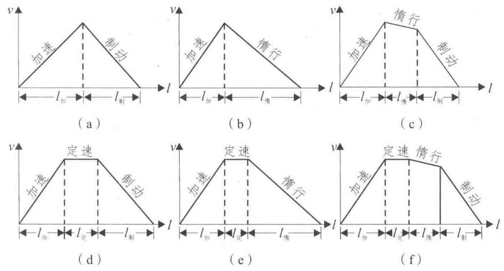

图 4.2 调车程类型图

调车程的时间有长有短, 影响调车程时间的因素主要有调车机车类型、调车程长度、调动车数和重量、调车速度、调车设备条件、气候、调车人员技术水平等。

## 三、调车作业时间标准

## (一) 调车作业时间分类

按照调车机车工时性质的不同，调车时间还可分为以下三类。

(1)生产时间:完成各项调车作业的纯生产时间，如解体、编组、摘挂、取送、转场、整理等各项作业的调车时间。

(2)辅助生产时间:为完成调车作业进行必要的准备工作所消耗的时间，如调车机车整备、 调车组交接班和吃饭时间等。

(3)非生产时间:由于各种原因妨碍调车作业所产生的调车机车停轮等待的时间，如等信号、等列检、等装卸等各种等待时间。

## (二) 确定调车作业时间标准的方法

各类调车作业时间标准是确定货车技术作业过程、计算车站改编能力以及进行作业决策的重要参数。

调车作业时间标准有两种:一种是单项作业时间标准，简称“钩分”，是指完成一个调车钩所需要的平均分钟数，按调车钩种类分别确定；另一种是综合作业时间标准，是指完成某一项调车工作所需要的平均分钟数, 按调车工作的类型分别确定, 例如解体或编组一个车列的时间标准, 每进行一次取送作业的时间标准等。

确定调车作业时间标准的方法有计算法和写实法两种。

计算法是根据调车程时间的影响因素, 利用回归分析法求出各种调车程时间的经验公式, 代入已知数据即可计算出调车程时间。此法在实际应用中有些理论问题尚需解决, 目前较少采用。

目前，我国铁路仍主要采用 “写实法” 查定调车作业时间标准，此项查定工作简称为 “查标”，分为工作日写实法和单项作业写实法两种。它可以是对车站调车工作的全面动态、全部工时的跟踪记录, 也可以按需要只对一项或几项调车作业单独写实。把调车程作为写实的基本单位, 要保持时间和作业动态的连续性。在取得写实资料后, 还要分析归类、汇总计算, 最后求出各种调车钩或各项作业的平均时间，将之作为相应的时分标准。

## 第三节 牵出线调车作业方法

牵出线是利用机车动力进行调车作业的一种调车设备。牵出线设在平道或不大于 2.5%。的坡道上, 通常为尽头式线路, 其贯通端与不同车场或不同线路相连, 是转场、转线作业的必经路线。在牵出线上也进行分解作业，此时主要利用机车动力使车组 (车辆) 积累一定动能后脱钩溜行，而不是主要依靠势能，这是其与驼峰的根本区别。牵出线的解体效率显然较低，但连挂作业较便捷。常用的牵出线调车方法有推送调车法和溜放调车法两种。

## 一、推送调车法

推送调车法是用机车将车辆调移至适当地点, 停稳后再摘车的调车方式, 其作业过程如图 4.3 所示, 利用该方式调车便于控制运行速度和作业安全。但车辆实现调移要发生推送和折返两个过程, 因此消耗的作业时间长, 效率较低。当不许可溜放作业时应采用推送调车方式, 例如调移客车和禁溜车辆向货场、专用线取送车，在特定线路上车列转线及车组连挂等，一般均采用本方式。

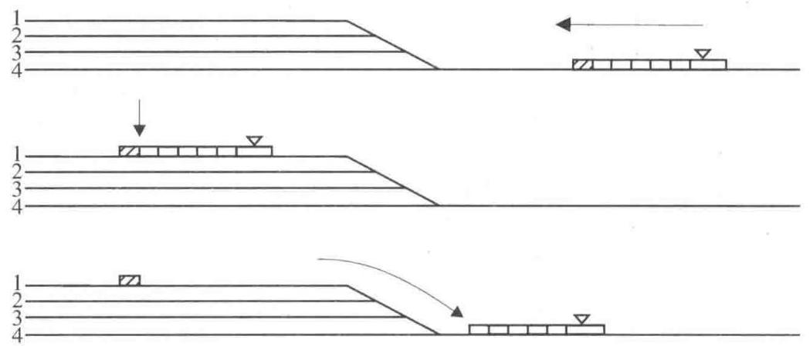

图 4.3 推送法调车示意图

## 二、溜放调车法

利用机车通常以推送车列的方式行进，在达到一定速度后使计划摘解的车组(车辆)脱离车列自行溜出的调车方式称为溜放调车法。为此, 在车列行进时应伺机摘钩, 然后机车制动, 以形成摘解车组与机带车列的速度差, 即发生两者的脱离及车组溜出。为使溜出车组能溜至预定位置或实现安全连挂, 由制动员对其施行手闸制动或铁鞋制动, 其作业过程如图 4.4 所示。

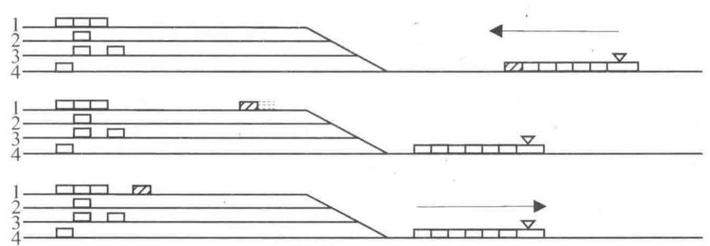

图 4.4 溜放法调车示意图

正确把握车组的溜出速度是保证调车安全、提高调车效率的重要前提。若溜出速度过低, 则车组不能溜至预定位置; 若速度过高, 不仅使机车的往返牵推过程延长, 而且也难以对溜出车组实现制动操作，产生安全隐患。车组溜出速度的大小主要取决于溜行距离、溜行阻力及车辆自身的溜行性能。因此, 调车人员要熟悉有关的线路及车辆情况, 应具有准确测距、测速的技能。

与推送调车方式相比, 溜放调车方式的分解行程短, 使用的调车程数少, 可显著提高调车效率, 在条件允许时均应采用溜放调车法。

当机车推动车列加减速各一次, 若同时溜出几个车组时, 为多组溜放方式。此时, 同批溜出的各车组需借助自身的不同走行性能和利用手闸调速而形成溜放间隔，才能分别溜入预定的线路。多组溜放时机车速度的变化情况如图 4.5 所示。显然, 用多组溜放方式分解车列, 其调车程比一般溜放方式要少得多, 调车效率更高, 但需要有更好的调车技术。

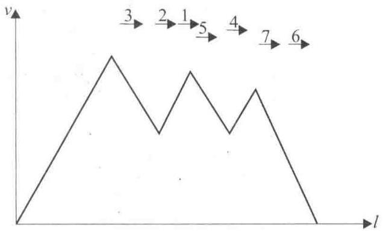

图 4.5 多组溜放法 $v = f\left( l\right)$ 图

当机车加速和减速一次将车组溜出后, 无论同批溜出的是单组还是多组, 机车可拖动未分解车列反向回拉, 以便进行后续溜放; 若线路等作业条件允许, 也可以不回拉, 在原行进方向继续调整速度实现后续批次的溜放, 这就是 “连续溜放方式”。所以, 对于溜放调车, 按一批溜放后是否回拉、每批溜放是单组还是多组以及在连续溜放过程中机车调速是否利用惯性惰行等, 可以将这些状态组合成诸如单组溜放、连续 (单组) 溜放、多组溜放、连续多组溜放、惰力 (连续)单组溜放和惰力(连续)多组溜放等多种细分的溜放调车方式。

还需要说明的是, 当有峰顶、调尾分工时, 牵出线主要完成连挂作业。在连续连挂的过程中, 由于机带车列(车组)阻挡司机视线，故需调车人员向司机依次显示 “十、五、三车”距离信号， 便于司机按当前运行距离调整速度，最终实现安全连挂。此时，机带车列(车组)越长，调移越不方便, 调车效率越低。为此, 只要不影响车列编成的合理性, 能够 “带小挂大” (即带动小车列连挂大车列) 时不要 “带大挂小”，这也是牵出线调车的一个重要方法和决策原则。

## 第四节 驼峰调车作业方法

## 一、驼峰简介

“驼峰”这一设备名称直接译义是“土岗”，我国铁路将之形象地称为“驼峰”。这是以利用峰上车辆的势能为主, 也借助于推峰产生的车辆动能而分解车列的一种调车设备。驼峰由推送部分、溜放部分和峰顶平台三个部位组成, 其平纵断面如图 4.6 所示。

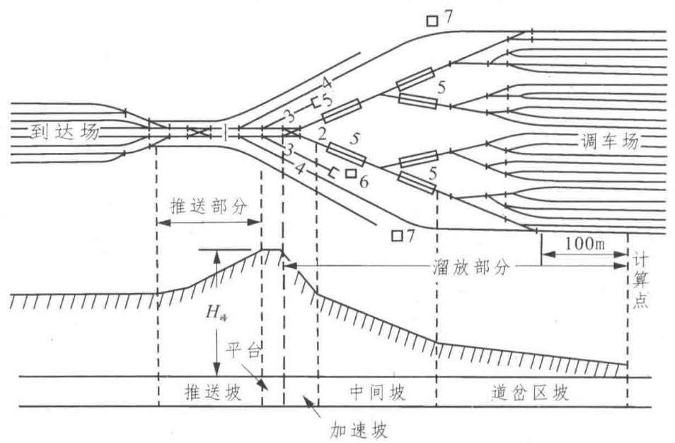

图 4.6 驼峰平纵断面图

1一推送线；2一溜放线；3一禁溜线；4一迂回线；5一减速器；6、7一驼峰信号楼

待解车列由推送坡上峰, 并在此处形成车钩的压缩状态, 便于提钩。被分解的车辆从溜放坡道下峰, 溜行的前后车组间应形成必要间隔, 才能适应各分路道岔的转岔过程。而且溜行车组既应有较快的溜行速度以求高效, 也应在特定地段符合过岔、打靶等速度限制以保证安全, 故对峰高及各坡段要有精细设计, 对各类调速装置应有恰当安设。设置峰顶平台可缓和两侧反向坡的连接, 防止过峰时车钩折损。

驼峰按其线路配置和技术设备的不同, 可分为简易驼峰、非机械化驼峰、机械化驼峰、半自动化驼峰和自动化驼峰, 它们依次体现出驼峰技术装备状况的发展完善和解体能力的逐步提升, 可按解编量大小分别采用。驼峰的设备有信号和道岔操纵设备以及调速制动工具。

简易驼峰一般是在原有牵出线的基础上修建的, 它具有设备简单、投资少、修建快、调车效率和安全性都比牵出线要好等优点,简易驼峰峰高较低,约为 ${1.5} \sim  2\mathrm{\;m}$ ,并只设一股推送线和一股溜放线；调车场头部平面为复式梯线形或对称线束形布置；设置的单开道岔采用电气集中或人工就地操纵；峰下咽喉区不设制动位，调车场内使用铁鞋制动车辆。我国铁路区段站上设置的驼峰大多数是这一类。

非机械化和机械化驼峰是目前我国铁路编组站驼峰的主要类型。一般设有两条推送线和两条溜放线, 调车场头部采用对称道岔和对称线束形布置, 道岔控制采用驼峰自动集中或电气集中。非机械化驼峰和机械化驼峰的主要区别在于前者的峰下咽喉区未设置车辆减速器的制动位, 只在调车场使用铁鞋制动车辆。非机械化驼峰一般设在调车线路较少、改编作业量不大的中小型编组站上。

自动化驼峰是装设有电子计算机和一系列自动控制设备, 能自动排列车组的溜放进路, 控制驼峰机车的推送速度, 操纵车辆减速器的调速设备, 实现车辆溜放过程自动化的驼峰。20 世纪 50 年代以来, 工业发达的铁路的主要编组站的驼峰开始逐步向自动化方向发展, 至 80 年代初期, 世界各国建成的自动化驼峰已近百处。我国于 20 世纪 60 年代开始自动化驼峰研究试验, 70 年代以来在测定车辆溜放阻力, 研究现代化驼峰平、纵断面设计理论和应用电子计算机等方面已取得进展，一些主要编组站的机械化驼峰正逐步向自动化驼峰过渡。

## 二、驼峰调车特点及解体作业程序

## (一)与牵出线调车相比驼峰调车具有的特点

(1)调车的动力。在牵出线上溜放调车主要靠机车的推动力；而在驼峰上溜放调车主要靠车辆本身所受的重力，辅以机车的推力。

(2)提钩的地点。在牵出线上溜放调车，机车推动车列逐钩移向调车场，提钩地点不固定； 而在驼峰上溜放调车，提钩地点基本上限制在推送坡至峰顶的一段距离内。

(3)溜放速度的控制。在牵出线上溜放调车，调车长控制速度的幅度较大，车辆走行性能对其溜行速度的影响不很显著; 而在驼峰上溜放调车, 调车长只能在接近峰顶的较小范围内调节推送速度，控制溜放速度的幅度很小，车辆溜行主要靠本身所受的重力，因此，车辆走行性能对其溜行速度的影响比较显著。

(4)车组间隔的调节。在牵出线上溜放调车，前后车组的间隔主要由调车长掌握推送速度和提钩时机来形成，并靠制动员以手闸调节；而在驼峰上溜放调车，车组的间隔主要由车组在峰上脱钩的时间间隔来形成。在机械化和自动化驼峰溜放调车，可以利用车辆减速器加以调节。

在机械化或自动化驼峰编组站, 为了使溜放车组进入调车线后能停留在预定的地点, 或以一定的限速与停留车组安全连挂, 在调车场通常采用以下三种制式的调速工具:

(1)点式控制，即在调车场各股道的固定地点设置减速器。这种方式适宜于在允许连挂速度较高的条件下采用。

(2)连续式控制，即在调车场各股道上连续布置减速顶、加减速顶、绳索牵引小车或直线电机加减速小车等调速工具, 随时随地控制溜放车组, 使之按各调速工具所规定的速度溜行, 直至与停留车连挂。这种方式适宜于在允许连挂速度较低的条件下采用。

(3)点连式控制，即在调车场各股道的前半部分设置减速器，后半部分设置连续式调速工具, 以达到车组安全连挂的要求。我国主要编组站多数采用这种制式。

## (二)驼峰解体作业程序

根据技术站到达场与调车场相互位置的不同, 驼峰机车解体车列的过程也不相同。

到达场与调车场纵向排列时, 驼峰机车的基本作业过程如图 4.7 所示, 即 ① 调机去到达场入口端连挂车列 (即挂车), ② 将车列推上峰顶 (即推峰), ③ 经由峰顶分解车列 (即溜放)。

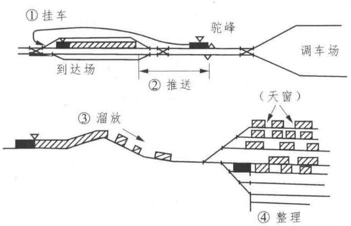

图 4.7 驼峰解体车列的作业过程图

到达场与调车场横向排列时, 驼峰机车的基本作业过程为:① 机车去到达场挂车， ② 将车列牵往推送线，③ 推峰，④ 溜放。

驼峰机车在分解几个车列后, 可能还需下峰整理线路上的存车，消除溜放车组间的天窗 (整场) (如图 4.7 中的④), 以及处理禁溜车和交换车等。

某些车辆由于其走行部侵入车辆减速器的限界, 或因车载货物的性质及装载状态, 通过驼峰时可能危及作业和货物安全, 这些车辆禁止过峰, 称为 “禁峰车”。有的车辆虽允许过峰, 但由于其所载货物的性质或所进入线路停有限速连挂的车组等原因, 禁止溜放, 只允许机车推送下峰，称为 “禁溜车”。《技规》《铁路危险货物运输管理规则》(以下简称《危规》) 以及 《站细》等对上述车辆及其调移方法有明确规定，必须遵照执行。

## 三、驼峰作业方案

按驼峰设备条件和作业机车的台数不同，驼峰调车作业组织可采取不同的作业方案。

## 1. 单推单溜

单推单溜是在只配备一台驼峰机车且改编工作量不大时采用的驼峰作业方案, 其作业情况如图 4.8 所示。相对于其他作业方案, 本方案驼峰作业周期 (指两次整场作业之间的时间间隔 ${T}_{\text{ 循环 }}$ ) 长,解体一个车列占用驼峰的平均时间 ( ${t}_{\text{ 占 }}$ ) 亦长。虽然机车很少发生作业等待的情况而运用效率较高, 但驼峰设备有较多空闲, 利用率低, 驼峰改编能力较小。

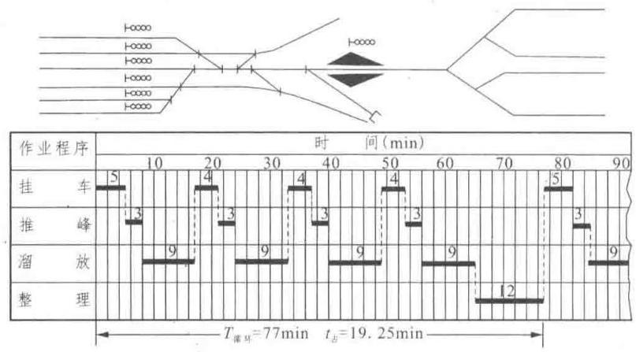

图 4.8 单推单溜驼峰作业方案图

## 2. 双推单溜

双推单溜是在具有两条推送线、一条溜放线、配备两台及以上机车工作且改编作业量较大时采用的一种驼峰作业方案，其作业情况如图 4.9 所示。该方案的显著特点是:当一台机车在峰顶分解车列时, 另一机车可与之平行地完成除推峰之外的其他作业程序而形成在峰顶前的 “预推”状态, 可很快实现另一车列解体作业的接续，使驼峰设备的利用率和改编能力显著提高。

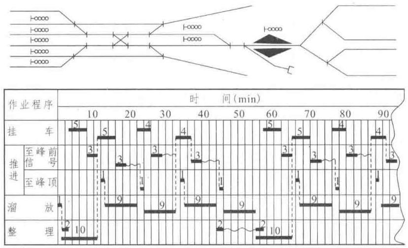

图 4.9 双推单溜驼峰作业方案图

## 3. 双推双溜

双推双溜是在具有两条推送线、两条溜放线、配备两台及以上机车工作时采用的一种作业方案, 如图 4.10 所示。该方案的特点是: 将调车场连同到达场纵向划分为两个独立的作业区, 各自配备 $1 \sim  2$ 台峰上机车工作,两区的推峰分解作业可同时平行进行,从而可大大提高推峰解体能力, 缩短分解一个车列占用推峰的平均时间。但是, 由于不能同时进行交叉性溜放, 出现邻区车流时只能在本区入线暂存，导致两区之间 “交换车流” 的出现，这在车站衔接方向多且各方向车流交互严重时尤其突出，需额外消耗一部分驼峰能力来处理交换车流。研究表明，当车站此类重复改编车数 (包括交换车和由此而增加的重复分解车数) 超过 20%时, 采用双推双溜一般不利。为减少交换车的重复改编作业量，当调车线宽余时，也可在本区内对交换的主要车流分类入线，但这将造成同一车流分线集结，延长集结过程；或增加峰尾编组的作业干扰，使相对薄弱的尾部能力进一步降低。

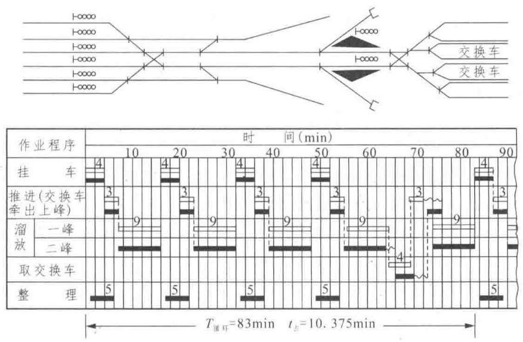

图 4.10 双推双溜驼峰作业方案图

能采用双推双溜作业方案的车站, 在驼峰设备条件许可时也可实行双推双溜与双推单溜相结合的作业方案。当解体车列出现邻区车流时, 可暂时停止邻区推峰机车的溜放作业, 或利用邻区推峰机车分解车列的时间空当, 经峰下交叉渡线向邻区分解车辆。这需要事先加强计划联系, 周密安排两区之间的作业配合。若到达场入口处有完善的疏解设备, 接车线路能够充分调配，还可按到达列车的车流构成机动调整其接入区域，以减少交换车的发生。

## 第五节 调车作业计划

## 一、概 述

调车作业计划是面向调车班组规定其作业程序的具体行动计划，应在车站阶段计划的框架约束下编制。其计划编制过程就是对调车作业效果的推断思考过程，即钩计划是调车决策意图的体现。对于出发车流, 其解编结果要符合编组计划的规定及《技规》中提出的技术安全要求；对于地方车流(含检修车辆)，其解编结果要符合相关作业环节的车组排列要求。

调车作业计划由调车领导人 (站调、助调或调车区长) 编制，编制依据为车站阶段计划、 列车确报及现车资料。调车作业计划编制的主要原则有:

(1)执行规章保安全——遵守列车编组计划、列车运行图和《技规》的有关规定。

(2)在安全的基础上提高效率——节省调车钩数，缩短调车行程，减轻调动重量，压缩作业时间。

调车作业计划以“调车作业通知单”的形式编出，见表 4.2。在其上部给出通知单的编号、 执行计划的调车，拟解编的车次(只对到发列车填)、列车所在股道(只对解体列车填)以及作业的规定开始终了时分等；在其下部给出股道解入辆数的合计值、计划编制人(区长或站调) 以及编制时间等。

表 4.2 调车作业通知单

<table><tr><td colspan="6" align="center">调车作业通知单</td></tr><tr><td>第(S004)号</td><td></td><td></td><td></td><td></td><td></td></tr><tr><td></td><td>(2)号调机 编/解(41028)次</td><td></td><td>( )道列车</td><td></td><td></td></tr><tr><td></td><td>开始: 10:10</td><td></td><td>终了:10:40</td><td></td><td></td></tr><tr><td>序</td><td>股道</td><td>甩挂</td><td>车号</td><td>备</td><td>注</td></tr><tr><td>1</td><td>BZ04</td><td>+24</td><td>3411132</td><td>禁代客</td><td>H1667</td></tr><tr><td>2</td><td>2</td><td>-11</td><td>5505254</td><td></td><td>定兰H854</td></tr><tr><td>3</td><td>4</td><td>-13</td><td>4623913</td><td>禁代客</td><td>H813</td></tr><tr><td>4</td><td>17</td><td>+4</td><td>4527551</td><td>$${\Delta 2}$$</td><td>兰东 Z322</td></tr><tr><td>5</td><td>2</td><td>+17</td><td>4600545</td><td></td><td>定兰 H1373</td></tr><tr><td>6</td><td>CF03</td><td>-21</td><td>4603674</td><td>$${\Delta 2}$$</td><td>H1695</td></tr><tr><td>股道</td><td>2</td><td>3</td><td>4</td><td></td><td></td></tr><tr><td>车数</td><td>11</td><td>13</td><td>21</td><td></td><td></td></tr><tr><td>区长</td><td>××</td><td></td><td>编制时间:06-04-06.09:25</td><td></td><td></td></tr></table>

对调车钩的安排是作业计划的实质内容，以每钩一行的方式进行描述。其中“序”栏给出作业排序，以便执行和统计钩数；在“股道”栏给出本钩作业的相关线路编号；在“甩挂”栏用 “ + ” 或 “ - ” 分别表示挂车作业或摘车作业，此后的数字表示挂取或摘送的辆数；在 “车号”栏注明所摘挂车组端部车辆的车号，它是本钩车终止而应摘钩开口的标志，当钩车内辆数较多时这是必要的，以免对摘钩位置判断失误；在“备注”栏有较多的标注内容，例如钩车中的特殊车辆 (如禁溜车、隔离车、关门车、客车等)、车组去向 (如表中的“定兰”、“兰东” 等)、 车组的空重状态 (如表中的 $\mathrm{K}\text{ 、 }\mathrm{Z}\text{ 、 }\mathrm{H}$ 等)、车组重量 (以 $\mathrm{t}$ 为单位) 以及其他作业事项等。

需要指出的是, 不同车站的钩计划形式可能存在某些差异。例如, 有的还注明了调车作业端，在备注栏使用了一些自行规定的符号等，但其对调车钩的表达形式都是相同的。

## 二、解体调车作业计划

对到达改编列车、完成装卸作业的地方车流以及修竣车等需进行解体作业，要编制相应的解体钩计划, 其特点是以溜放钩数为主。解体作业通常在车场头部进行, 当车场横列布置尤其是无驼峰设施时, 可根据待解车列的构成及其他作业条件选取合理的作业端, 或安排两端协同进行。

## (一)一般情况解体调车

在纵列式车站实行整列推峰, 向固定线路分解车辆。在横列式车站采用以下三种方式:

(1)整列牵出解体，向固定线路分解车辆。

(2)分部牵出解体——注意开口位置，减少钩数和重量。

(3)两端合作解体——注意作业均衡，尽量利用“坐编”。所谓“坐编”，是将符合编组要求的大车组留在到发线上直接编组。

## (二)活用线路情况解体调车

活用线路情况主要有解体照顾编组、解体照顾送车、临时借用线路三种情况。

(1)解体照顾编组——在解体过程中直接完成一部分编组作业。

(2)解体照顾送车——在解体过程中为送车挑选车组，或利用空车交本站货物作业车。

(3)临时借用线路——当某去向集结车流超过该固定线路最大容车数时可借用线路，作业完了恢复固定使用。

为减轻调动重量，可采用分部解体的方法对待解车列选定开口位置。开口位置选择合理还可减少钩数、提高调车效率。例如，在到发线运用不紧张且待解车列中有大车组能较快接续出发时, 可将该车组留在原到发线上而不参与解体调车, 这就是所谓的按 “坐编” 开口, 留在到发线上的大车组称为 “坐编” 车辆。显然, “坐编” 方式的调车效率高, 能使车流尽快接续。

【例 4.1】设 $D$ 站衔接方向如图 4.11 所示。 $D$ 站线路固定使用办法为: $1 \sim  5$ 道为到发线, 6~15 道为调车线，其中 6 道集结 $A$ 站车流，7 道集结 $B$ 站及 $A - B$ 间车流，8 道集结 $C$ 站及 $B - C$ 间车流,9 道集结 $C - D$ 间车流,14 道集结本站作业车,其他股道使用办法略。若 35002 次到达解体列车停于 3 道, 其编组内容见表 4.3 ，则可有表 4.4 所列的解体作业计划。

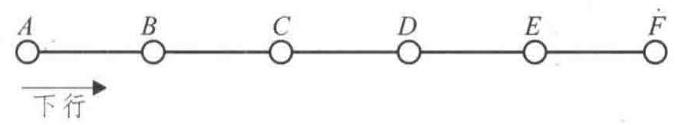

图 4.11 $D$ 站衔接方向图

表 4.3 35002 次列车编组内容

<table><tr><td>车组位置</td><td>车组到站</td></tr><tr><td>1~8</td><td>$$A$$</td></tr><tr><td>9~12</td><td>$$C$$</td></tr><tr><td>13~15</td><td>$$A - B$$</td></tr><tr><td>16</td><td>$$D$$</td></tr><tr><td>17~18</td><td>$$B - C$$</td></tr><tr><td>19~24</td><td>$$B$$</td></tr><tr><td>25~28</td><td>$$D$$</td></tr><tr><td>29</td><td>$$A$$</td></tr><tr><td>30~31</td><td>$$B$$</td></tr><tr><td>32~35</td><td>$$C - D$$</td></tr><tr><td>36~37</td><td>$$C$$</td></tr><tr><td>38~40</td><td>$$B - C$$</td></tr></table>

表 4.4 35002 次解体作业计划(调机自尾部挂车)

<table><tr><td>股道</td><td>摘或挂</td><td>车数</td></tr><tr><td>3</td><td>+</td><td>40</td></tr><tr><td>6</td><td>-</td><td>8</td></tr><tr><td>8</td><td>-</td><td>4</td></tr><tr><td>7</td><td>-</td><td>3</td></tr><tr><td>14</td><td>-</td><td>1</td></tr><tr><td>8</td><td>-</td><td>2</td></tr><tr><td>7</td><td>-</td><td>6</td></tr><tr><td>14</td><td>-</td><td>4</td></tr><tr><td>6</td><td>-</td><td>1</td></tr><tr><td>7</td><td>-</td><td>2</td></tr><tr><td>9</td><td>-</td><td>4</td></tr><tr><td>8</td><td>-</td><td>5</td></tr></table>

## 三、编组调车作业计划

当车辆按去向和类别在固定线路上集结时, 可将相关各车组连挂成列并转场完成编组作业, 对此所编制的钩计划为编组调车作业计划。编组调车以连挂钩为主, 故通常在车场尾部进行。

实际上编组调车远比上述过程复杂, 这主要是因为车流构成及数量有较大的波动性, 线路活用或车流混线集结是必然发生的现象。尤其是对诸如摘挂列车之类的多组车列进行编组，出现关门车和有隔离要求的车辆而有编挂限制，以及对地方车流和不良车辆按其后续作业地点选编时，都有复杂的决策及作业过程。这也体现出解体和编组调车因承担“选编车流”这一共同任务而有内在的一致性。但按传统习惯，仍然把在峰尾进行的这些作业视为编组调车。

由于车辆通常按列车编组计划的去向在调车场的固定线路上进行集结，所以一般列车的编组调车作业只是进行车组的连挂 (在一条调车线上连挂车组或将 $2 \sim  3$ 条线上的车辆连接成车列)和转线(将车列从调车场转到出发场)。当车辆的编挂位置不符合《技规》等关于编组列车的要求时，才需进行分解调车作业。

直达、直通、区段列车的编组作业计划主要有连挂车组、车列转线、按《技规》要求“倒隔离”。摘挂列车的编组作业计划主要有以下两种情况:

(1)按站顺编组——列车中车组排列顺序按区段内中间站的顺序由近及远的顺序排列。

【例 4.2】 $M - N$ 区段示意图如图 4.12 所示。

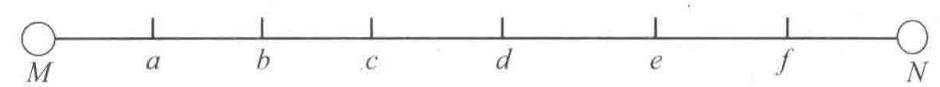

图 4.12 $M - N$ 站示意图

如果 $M$ 站编组摘挂列车发往 $N$ 站,则车组排列顺序应为: 机车次位为 $a$ 站车组,接着是 $b$ 站, $c$ 站, $d$ 站, $e$ 站,最后是 $f$ 站车组,如图 4.13 所示。

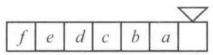

图 4.13 车组顺序排列示意图

(2)按到站成组编组——车组顺序与中间站顺序可以不一致，但同一到站的车辆必须紧密排在一起, 不得分开。如上例中, 车列编成后车组排列顺序可以是 dfcabe 机车, 但若是 fcdbcaea 机车则是不允许的,因为 $c$ 站车辆和 $a$ 站车辆被分开了。

## 四、按站顺编组摘挂列车时调车作业计划的编制方法

为了叙述方便，先用阿拉伯数字代表车组到站，车组编成后，车组排列顺序为自然排列， 即自左至右为 ${123}\cdots$ 。如例 4.2 中, $f$ 站车组对应为 1 号, $e$ 站车组对应为 2 号, $\cdots \cdots , a$ 站对应为 6 号。编制调车作业计划的目的就是把杂乱无章的待编车列变成自然排列, 下标表示车组所包含的车数,如 ${1}_{2}$ 表示 1 号车组有 2 辆车。如果没有特殊说明,假定调机的作业位置一律在右边。

编制摘挂列车的调车计划可用调车表来进行。表格实际上就是调车场的示意图，调车机车在右端作业，横格称为 “列”，表示每条线路；竖格称为 “行”，表示车组在待编车列中相互位置; “行”与 “列” 的交点表示每个车组分解到那条线路。这样, 通过在调车表上进行 “下落” “调整” “合并” 等步骤, 就可把顺序杂乱的待编车列变成接连顺序的车列, 从而实现摘挂列车的编组要求, 具体编制过程如下所述。

## 1. 下 落

在编组摘挂列车时, 为了调转顺序, 需要把待编车列中的反顺序车组分解到不同线路上, 这样的调车过程反映在调车表上即所谓的车组下落。车组下落的方法是:从左端起先找表格上部所填记的待编车列中的第一个 “ 1 ” 号车组, 将其下落到第一列, 然后向右找出全部 1 号车组, 若无 1 号车组, 则继续向右找出 2 号车组, 并下落到第一列。如果 1 号车组的左方有 2 号车组, 则在 1 号车组右方下落全部 2 号车组后，第一列下落工作即告完毕，否则，在第一列还可下落 3 号车组，如此类推。

第一列下落完毕后, 再从左至右找第一列最后部车组的同号车组, 无同号车组时找其大一号的车组, 下落到第二列, 并按第一列下落的规则填写完第二列, 如此类推, 直至全部车组下落完毕为止。

## 2. 调 整

有些车组在下落时不一定只有一个位置, 而是可在两列之间移动的。这种可在两列中调整位置的车组称为可调车组。至于如何确定可调车组的有利位置, 则应与 “合并” 方式的选择结合起来考虑。

## 3. 合 并

待编车列下落的每一列如果单独占用一条线路, 则只需从最大列号开始, 依次连挂各列便可编成符合顺序要求的车列, 但这时将消耗下落列数相等的推送钩数。研究发现, 待编车列下落的各列中一部分列需各自占用一条线路, 而另一部分列则可组成一个或几个暂合列合并使用线路，从而可减少编组列车的推送钩数。

【例 4.3】编制编组摘挂列车调车作业计划，调机在右端作业，要求按站顺编组。 $M$ 站与相邻技术站 $N$ 站间中间站设置如图 4.14 所示。

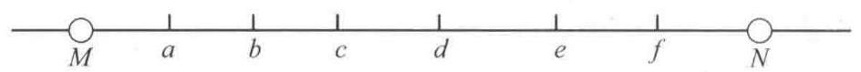

图 4.14 $M - N$ 区段中间站设置图

需要编组 $M$ 站出发去 $N$ 站的摘挂列车，待编车列为:

$$
{b}_{2}{a}_{1}{c}_{1}{f}_{2}{e}_{1}{b}_{1}{f}_{2}{a}_{2}{c}_{1}{e}_{1}{d}_{2}{a}_{1}
$$

编成后车组排列顺序: fedcba, 车组代号为: 123456

待编车列编号为: ${5}_{2}{6}_{1}{4}_{1}{1}_{2}{2}_{1}{5}_{1}{1}_{2}{6}_{2}{4}_{1}{2}_{1}{3}_{2}{6}_{1}$

采用表格调车法进行编制调车作业计划。在调车表中, 最上一行填写待编车列编号, 下面各行作车组下落用, 称为 “下落列”。下落的方法是将待编车列自左至右由小到大顺序下落于表中。

若待编车列 ${5}_{2}{6}_{1}{4}_{1}{1}_{2}{2}_{1}{5}_{1}{1}_{2}{6}_{2}{4}_{1}{2}_{1}{3}_{2}{6}_{1}$ 停于 10 道,可利用 11,12,13 道作业,车列编成后转往到发场 3 道。调车表见表 4.5 (注: 为简化, 省去了下标; 股道的确定方法后面介绍)。

表 4.5 原始调车表

<table><tr><td>股道</td><td>下落列</td><td>5</td><td>6</td><td>4</td><td>1</td><td>2</td><td>5</td><td>1</td><td>6</td><td>4</td><td>2</td><td>3</td><td>6</td></tr><tr><td></td><td>一</td><td></td><td></td><td></td><td>1</td><td></td><td></td><td>1</td><td></td><td></td><td>2</td><td></td><td></td></tr><tr><td></td><td>二</td><td></td><td></td><td></td><td></td><td>2</td><td></td><td></td><td></td><td></td><td></td><td>3</td><td></td></tr><tr><td></td><td>三</td><td></td><td></td><td>4</td><td></td><td></td><td></td><td></td><td></td><td>4</td><td></td><td></td><td></td></tr><tr><td></td><td>四</td><td>5</td><td></td><td></td><td></td><td></td><td>5</td><td></td><td>6</td><td></td><td></td><td></td><td>6</td></tr><tr><td></td><td>五</td><td></td><td>6</td><td></td><td></td><td></td><td></td><td></td><td></td><td></td><td></td><td></td><td></td></tr></table>

可放在两相邻下落列中任何一列的车组称为可调车组。如表 4.5 中第一列中的 2 号车组, 若把它放在第二列也是可以的, 不会打乱下落次序, 故 2 号车组即为可调车组。如果将 2 号车组放在第二列, 则它与 3 号车组连在一起, 形成 “邻组”, 分解时可以一钩溜出去, 可节省一个溜放钩, 这是可调车组的主要作用。如果 2 号调到第二列, 第一列中的 1 号也可调到第二列, 也有一个临组, 又可节省一个溜放钩, 可见灵活处理可调车组是有利的。调整的结果见表 4.6 (注: 第四列的两个 6 号车组也是可调车组 )。

表 4.6 调整后的调车表

<table><tr><td>股道</td><td>下落列</td><td>5</td><td>6</td><td>4</td><td>1</td><td>2</td><td>5</td><td>1</td><td>6</td><td>4</td><td>2</td><td>3</td><td>6</td></tr><tr><td></td><td>一</td><td></td><td></td><td></td><td></td><td></td><td></td><td>1</td><td></td><td></td><td></td><td></td><td></td></tr><tr><td></td><td>二</td><td></td><td></td><td></td><td>1</td><td>2</td><td></td><td></td><td></td><td></td><td>2</td><td>3</td><td></td></tr><tr><td></td><td>三</td><td></td><td></td><td>4</td><td></td><td></td><td></td><td></td><td></td><td>4</td><td></td><td></td><td></td></tr><tr><td></td><td>四</td><td>5</td><td></td><td></td><td></td><td></td><td>5</td><td></td><td>6</td><td></td><td></td><td></td><td>6</td></tr><tr><td></td><td>五</td><td></td><td>6</td><td></td><td></td><td></td><td></td><td></td><td></td><td></td><td></td><td></td><td></td></tr></table>

将两个或多个下落列合并在一起所形成的列称为暂合列。暂合的目的主要有两个:

(1)减少挂车钩(或日推送钩)，缩短总的调车作业时间。暂合之后，下落列减少，所用的挂车钩相应地减少，但需要对暂合列重复分解，可能使溜放钩增加。由于一个挂车钩花的时间相当于 $3 \sim  5$ 个溜放钩，所以总的调车作业时间还是压缩了。

(2)减少所需的线路数。一个下落列对应一条调车线路，下落列减少了，所需的线路数自然就少了。如上例中, 若不暂合, 需要 5 条线, 两列暂合, 则只需要 4 条线。

根据 “对口理论”, 构成暂合列时应注意下列原则:

(1)第一列一般不与其他列合并；

(2)相邻的列一般不要合并；

(3)尽量使暂合列形成 “邻组”；

(4)尽量利用“机前集结”，即符合顺序要求的车组紧靠调机，分解时可以不溜去，以节省溜放钩。

以表 4.6 为例, 可以二、四列暂合, 也可二、五列暂合, 还可三、五列暂合。由观察知, 二、四列暂合可形成两个邻组, 且 236 恰好位于机前, 可由机车带着, 减少溜放钩。二、四暂合之后的调车表见表 4.7。为便于比较, 将原来第四列用括号括上或用圆圈圈上。

表 4.7 二、四列暂合的调车表

<table><tr><td>股道</td><td>下落列</td><td>$${5}_{2}$$</td><td>$${6}_{1}$$</td><td>$${4}_{1}$$</td><td>$${1}_{1}$$</td><td>$${2}_{1}$$</td><td>$${5}_{1}$$</td><td>$${1}_{2}$$</td><td>$${6}_{2}$$</td><td>$${4}_{1}$$</td><td>$${2}_{1}$$</td><td>$${3}_{2}$$</td><td>$${6}_{1}$$</td></tr><tr><td>11</td><td>一</td><td></td><td></td><td></td><td></td><td></td><td></td><td>$${1}_{2}$$</td><td></td><td></td><td></td><td></td><td></td></tr><tr><td>10</td><td>二、四</td><td>$$({5}_{2})$$</td><td></td><td></td><td>$${1}_{2}$$</td><td>$${2}_{1}$$</td><td>$$({5}_{1})$$</td><td></td><td>$$({6}_{2})$$</td><td></td><td>$${2}_{1}$$</td><td>$${3}_{2}$$</td><td>$$({6}_{1})$$</td></tr><tr><td>12</td><td>三</td><td></td><td></td><td>$${4}_{1}$$</td><td></td><td></td><td></td><td></td><td></td><td>$${4}_{1}$$</td><td></td><td></td><td></td></tr><tr><td>13</td><td>五</td><td></td><td>$${6}_{1}$$</td><td></td><td></td><td></td><td></td><td></td><td></td><td></td><td></td><td></td><td></td></tr></table>

表 4.7 中有 4 个下落列, 需要 4 条股道。考虑牵出时留一车组坐底, 可节省一溜放钩, 故令二、四暂合为待编车列停留的股道，其余可随便安排。股道的分配结果见表 4.7。

根据表 4.7, 做出调车作业计划如下:

此计划共用 5 个挂车钩, 10 个溜放钩, 1 个转线钩。如果二、五列暂合, 或三、五列暂合, 做出的计划将是不一样的, 见表 4.8。

表 4.8 调车作业计划

<table><tr><td>10 + 15</td><td>12 – 2</td></tr><tr><td>13 – 1</td><td>11 – 3</td></tr><tr><td>12 – 1</td><td>12 – 3</td></tr><tr><td>10 – 4</td><td>11 – 3</td></tr><tr><td>11 – 2</td><td>13 + 1</td></tr><tr><td>10 – 2</td><td>12 + 7</td></tr><tr><td>12 – 1</td><td>11 + 8</td></tr><tr><td>10 + 8</td><td>DF3 - 17</td></tr></table>

由此可得, 编制调车作业计划的步骤为:

(1)画调车表，车组下落。

(2)利用可调车组调整调车表。

(3)选择有利的暂合列方案。

(4)确定股道分配方案。

(5)编写调车作业计划。

【例 4.4】编制 $M$ 站编组摘挂列车调车作业计划，调机在右端作业, 要求按站顺编组, 编成后车列顺序为 123……，待编车列的排列顺序为:

$$
\text{ e d g a f b g f c e a }
$$

$M$ 站与相邻技术站 $N$ 站间中间站设置如图 4.14 所示。

解: 根据按站顺编组摘挂列车的要求, 列车编成后各中间站车组的排列顺序及编号为:

$$
\begin{array}{lllllll} g & f & e & d & c & b & a \\  1 & 2 & 3 & 4 & 5 & 6 & 7 \end{array}
$$

故待编车列中各车组的编号为:

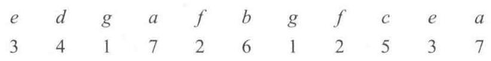

第一步，画调车表，进行车组下落，见表 4.9。

表 4.9 调车表

<table><tr><td colspan="2" rowspan="2">第二批   第一批   列股道</td><td></td><td></td><td></td><td></td><td></td><td></td><td></td><td></td><td></td><td></td><td></td></tr><tr><td>3</td><td>4</td><td>1</td><td>7</td><td>2</td><td>6</td><td>1</td><td>2</td><td>5</td><td>3</td><td>7</td></tr><tr><td>一</td><td>10</td><td></td><td></td><td>$$\dot 1$$</td><td></td><td></td><td></td><td>1</td><td>$$\dot 2$$</td><td></td><td></td><td></td></tr><tr><td>二</td><td>11</td><td></td><td></td><td></td><td></td><td>2</td><td></td><td></td><td></td><td></td><td>3</td><td></td></tr><tr><td>三</td><td>12</td><td>3</td><td>4</td><td></td><td></td><td></td><td></td><td></td><td></td><td>5</td><td></td><td></td></tr><tr><td>四</td><td>13</td><td></td><td></td><td></td><td></td><td></td><td>6</td><td></td><td></td><td></td><td></td><td>7</td></tr><tr><td>五</td><td>14</td><td></td><td></td><td></td><td>7</td><td></td><td></td><td></td><td></td><td></td><td></td><td></td></tr></table>

第二步，调整。

因为车组 $\dot{2}$ 既可落在第一列,也可落在第二列,若车组 $\dot{2}$ 落在第二列, 则车组 i 也可落在第一列或第二列, 因此车组 2 为可调车组。显然, $\dot{7}$ 也是可调车组。至于如何确定可调车组的有利位置,则应与 “合并”方式的选择结合起来考虑。

第三步，组合暂合列。

表 4.9 共下落五列, 若不合并使用线路, 则分解时需用五条线路, 因此整个编组过程须用 13 钩, 19 个调车程, 其中推送钩 6 钩, 溜放钩 7 钩 (未计向到发线转线的调车钩), 其调车作业计划见表 4.10。

<table><tr><td>12 + 9</td></tr><tr><td>10 – 1</td></tr><tr><td>14 – 1</td></tr><tr><td>11 – 1</td></tr><tr><td>13 – 1</td></tr><tr><td>10 – 2</td></tr><tr><td>12 – 1</td></tr><tr><td>11 – 1</td></tr><tr><td>14 + 1</td></tr><tr><td>13 + 1</td></tr><tr><td>12 + 3</td></tr><tr><td>11 + 2</td></tr><tr><td>10 + 3</td></tr><tr><td>DF5 - 11</td></tr></table>

表 4.10 调车作业计划

如在下落的基础上将第二、四、五列暂时合并为一列 (见表 4.11)， 则可少用两条线路, 减少两个推送钩。虽然向暂合列挂车需多用一个推送钩, 但仍可节省一个推送钩。至于溜放钩, 由于需重复分解暂合列可能会有所增加 (本例并不增加), 但因每个推送钩所需的时间约为溜放钩的 3~5 倍,所以如果合并方式选择得当 (如各列车组合并后不交错或很少交错,合并时能利用待编车列的邻组或利用机后集结车组等), 则合并使用线路将是有利的。

表 4.11 调车表

<table><tr><td rowspan="2" colspan="2">第二批   第一批   列股道</td><td></td><td></td><td></td><td></td><td></td><td></td><td></td><td></td><td></td><td></td><td></td></tr><tr><td>3</td><td>4</td><td>1</td><td>7</td><td>2</td><td>6</td><td>1</td><td>2</td><td>5</td><td>3</td><td>7</td></tr><tr><td>一</td><td>10</td><td></td><td></td><td>1</td><td></td><td></td><td></td><td>1</td><td>2</td><td></td><td></td><td></td></tr><tr><td>二</td><td>11</td><td></td><td></td><td></td><td>7</td><td>2</td><td>6</td><td></td><td></td><td></td><td>3</td><td>7</td></tr><tr><td>三</td><td>12</td><td>3</td><td>4</td><td></td><td></td><td></td><td></td><td></td><td></td><td>5</td><td></td><td></td></tr><tr><td>四</td><td></td><td></td><td></td><td></td><td></td><td></td><td>⑥</td><td></td><td></td><td></td><td></td><td>⑦</td></tr><tr><td>五</td><td></td><td></td><td></td><td></td><td>⑦</td><td></td><td></td><td></td><td></td><td></td><td></td><td></td></tr></table>

注:带○者表示车组已合并他列，下同。

<table><tr><td>12 + 9</td></tr><tr><td>10 – 1</td></tr><tr><td>11 – 3</td></tr><tr><td>10 – 2</td></tr><tr><td>12 – 1</td></tr><tr><td>11 + 2</td></tr><tr><td>10 – 1</td></tr><tr><td>12 – 1</td></tr><tr><td>10 – 1</td></tr><tr><td>11 + 1</td></tr><tr><td>12 + 4</td></tr><tr><td>10 + 5</td></tr><tr><td>DF5 - 11</td></tr></table>

表 4.12 调车作业计划

本例合并使用线路时 (见表 4.11 ) 的调车作业计划见表 4.12 , 该计划共用 12 钩, 17 个调车程, 其中需用推送钩 5 钩, 溜放钩 7 钩, 比未合并使用线路时减少一个推送钩。

【例 4.5】编组摘挂列车调车作业计划, 调机在右端作业, 编成后车列顺序为 1234……，待编车列 ${4}_{3}{7}_{3}{2}_{4}{7}_{2}{6}_{5}{3}_{3}{1}_{2}{4}_{3}{5}_{4}{7}_{2}{6}_{4}{5}_{3}{2}_{4}$ 。待编车列停在调车场 11 道，需采用分批解体。

解: 首先确定开口位置。开口位置的确定应按 “当尾组在左, 首组在右时, 开口位置应选在首、尾组之间, 反之, 则应选在首、尾组的两边” 的开口原则, 以减少下落列数。本例首组为 1 , 尾组为 7 , 因此可在车组 3 与 1 之间开口。这样, 调车表的填写与下落后的情况见表 4.13。

表 4.13 调车表

<table><tr><td></td><td>第二批</td><td></td><td></td><td></td><td></td><td></td><td></td><td></td><td>$${4}_{3}$$</td><td>$${7}_{3}$$</td><td>$${2}_{4}$$</td><td>$${7}_{2}$$</td><td>$${6}_{5}$$</td><td>$${3}_{2}$$</td><td>$${7}_{2}$$</td></tr><tr><td></td><td>第一批</td><td>$${1}_{2}$$</td><td>$${4}_{3}$$</td><td>$${5}_{4}$$</td><td>$$({7}_{2})$$</td><td>$${6}_{4}$$</td><td>$${5}_{3}$$</td><td>$${2}_{4}$$</td><td></td><td></td><td></td><td></td><td></td><td></td><td></td></tr><tr><td>列</td><td>股道</td><td></td><td></td><td></td><td></td><td></td><td></td><td></td><td></td><td></td><td></td><td></td><td></td><td></td><td></td></tr><tr><td>一</td><td></td><td>1</td><td></td><td></td><td></td><td></td><td></td><td>2</td><td></td><td></td><td>2</td><td></td><td></td><td>3</td><td></td></tr><tr><td>二</td><td></td><td></td><td>$$\dot 4$$</td><td></td><td></td><td></td><td></td><td></td><td>4</td><td></td><td></td><td></td><td></td><td></td><td></td></tr><tr><td>三</td><td></td><td></td><td></td><td>5</td><td></td><td></td><td>5</td><td></td><td></td><td></td><td></td><td></td><td>6</td><td></td><td></td></tr><tr><td>四</td><td></td><td></td><td></td><td></td><td></td><td>6</td><td></td><td></td><td></td><td>7</td><td></td><td>7</td><td></td><td></td><td>7</td></tr><tr><td>五</td><td></td><td></td><td></td><td></td><td>⑦</td><td></td><td></td><td></td><td></td><td></td><td></td><td></td><td></td><td></td><td></td></tr></table>

表 4.14 调车表

<table><tr><td></td><td>第二批</td><td></td><td></td><td></td><td></td><td></td><td></td><td></td><td>$${4}_{3}$$</td><td>$${7}_{3}$$</td><td>$${2}_{4}$$</td><td>$${7}_{2}$$</td><td>$${6}_{5}$$</td><td>$${3}_{2}$$</td><td>$${7}_{2}$$</td><td>$${6}_{4}$$</td></tr><tr><td></td><td>第一批</td><td>$${1}_{2}$$</td><td>$${4}_{3}$$</td><td>$${5}_{4}$$</td><td>$$({7}_{2})$$</td><td>$$({6}_{4})$$</td><td>$${5}_{3}$$</td><td>$${2}_{4}$$</td><td></td><td></td><td></td><td></td><td></td><td></td><td></td><td></td></tr><tr><td>列</td><td>股道</td><td></td><td></td><td></td><td></td><td></td><td></td><td></td><td></td><td></td><td></td><td></td><td></td><td></td><td></td></tr><tr><td>一</td><td>10</td><td>1</td><td></td><td></td><td></td><td></td><td></td><td>2</td><td></td><td></td><td>2</td><td></td><td></td><td>3</td><td></td><td></td></tr><tr><td>二</td><td>11</td><td></td><td>④</td><td></td><td></td><td></td><td></td><td></td><td>4</td><td>7</td><td></td><td>7</td><td></td><td></td><td>7</td><td></td></tr><tr><td>三</td><td>13</td><td></td><td>4</td><td>5</td><td></td><td></td><td>5</td><td></td><td></td><td></td><td></td><td></td><td>6</td><td></td><td></td><td>6</td></tr><tr><td>四</td><td></td><td></td><td></td><td></td><td></td><td>⑥</td><td></td><td></td><td></td><td>⑦</td><td></td><td>⑦</td><td></td><td></td><td>⑦</td><td></td></tr><tr><td>五</td><td></td><td></td><td></td><td></td><td>⑦</td><td></td><td></td><td></td><td></td><td></td><td></td><td></td><td></td><td></td><td></td><td></td></tr></table>

由表 4.13 可见, 第五列只有第一批分解的一个车组 7, 如在分解时把其溜放到第二批分解的车组之后 (见点线右端), 则下落列数可少一列, 并且本例并不增加溜放钩数。在下落四列的情况下, 应采取第二列和第四列合并的方式 (见表 4.14 )。为了减少暂合列中各列车组的交错次数,在合并的同时,将可调车组 $i$ 从第二列调整到第三列, 从而又能利用一处待编车列的邻组, 再将第一批分解的车组 6 也溜到第二批分解的车列之后。这样, 虽然增加了解体暂合列的溜放钩, 但因采取调整和合并的步骤, 利用了邻组, 又节省了溜放钩。从而使用三条线编组比使用五条线编组节省了两个推送钩和一个溜放钩。

按表 4.14 编制的调车作业计划见表 4.15 ，该计划共用 17 钩 (未含转线钩)，22 个调车程，其中推送钩 5 钩，溜放钩 12 钩。

<table><tr><td>11 + 22</td></tr><tr><td>10 – 2</td></tr><tr><td>13 – 7</td></tr><tr><td>11 – 6</td></tr><tr><td>13 – 3</td></tr><tr><td>10-4</td></tr><tr><td>11 + 20</td></tr><tr><td>10-4</td></tr><tr><td>11-2</td></tr><tr><td>13-5</td></tr><tr><td>10-3</td></tr><tr><td>11-2</td></tr><tr><td>13-4</td></tr><tr><td>11 + 10</td></tr><tr><td>10 – 3</td></tr><tr><td>13 + 19</td></tr><tr><td>10 + 16</td></tr><tr><td>DF3 - 42</td></tr></table>

表 4.15 调车作业计划

【例 4.6】待编车列 ${4}_{2}{5}_{1}{6}_{1}{3}_{1}{5}_{2}{1}_{3}{2}_{1}{4}_{3}{3}_{2}{6}_{1}{5}_{1}{3}_{2}{1}_{1}{4}_{2}{7}_{2}$ 停于调车场 7 道,要求按站顺编组,车列编成后的顺序为 ${123}\cdots$ ,调机在右端作业，采用一批分解，允许使用 7、8、9、10 四条道作业，编成后转往出发场 3 道。试用调车表编制调车作业计划。

解: 第一步, 画调车表, 进行车组下落 (见表 4.16 )。

表 4.16 调车表

<table><tr><td>股道</td><td>下落列</td><td>$${4}_{2}$$</td><td>$${5}_{2}$$</td><td>$${6}_{1}$$</td><td>$${3}_{1}$$</td><td>$${5}_{2}$$</td><td>$${1}_{3}$$</td><td>$${2}_{1}$$</td><td>$${4}_{3}$$</td><td>$${3}_{2}$$</td><td>$${6}_{1}$$</td><td>$${5}_{1}$$</td><td>$${3}_{2}$$</td><td>$${1}_{1}$$</td><td>$${4}_{2}$$</td><td>$${7}_{2}$$</td></tr><tr><td></td><td>一</td><td></td><td></td><td></td><td></td><td></td><td>$${1}_{3}$$</td><td></td><td></td><td></td><td></td><td></td><td></td><td>$${1}_{1}$$</td><td></td><td></td></tr><tr><td></td><td>二</td><td></td><td></td><td></td><td></td><td></td><td></td><td>$${2}_{1}$$</td><td></td><td>$${3}_{2}$$</td><td></td><td></td><td>$${3}_{2}$$</td><td></td><td></td><td></td></tr><tr><td></td><td>三</td><td></td><td></td><td></td><td>$${3}_{1}$$</td><td></td><td></td><td></td><td>$${4}_{3}$$</td><td></td><td></td><td></td><td></td><td></td><td>$${4}_{2}$$</td><td></td></tr><tr><td></td><td>四</td><td>$${4}_{2}$$</td><td>$${5}_{2}$$</td><td></td><td></td><td>$${5}_{2}$$</td><td></td><td></td><td></td><td></td><td></td><td>$${5}_{1}$$</td><td></td><td></td><td></td><td></td></tr><tr><td></td><td>五</td><td></td><td>.</td><td>$${6}_{1}$$</td><td></td><td></td><td></td><td></td><td></td><td></td><td>$${6}_{1}$$</td><td></td><td></td><td></td><td></td><td>$${7}_{2}$$</td></tr></table>

第二步, 调整 (见表 4.17)。

表 4.17 调车表

<table><tr><td>股道</td><td>下落列</td><td>$${4}_{2}$$</td><td>$${5}_{2}$$</td><td>$${6}_{1}$$</td><td>$${3}_{1}$$</td><td>$${5}_{2}$$</td><td>$${1}_{3}$$</td><td>$${2}_{1}$$</td><td>$${4}_{3}$$</td><td>$${3}_{2}$$</td><td>$${6}_{1}$$</td><td>$${5}_{1}$$</td><td>$${3}_{2}$$</td><td>$${1}_{1}$$</td><td>$${4}_{2}$$</td><td>$${7}_{2}$$</td></tr><tr><td></td><td>一</td><td></td><td></td><td></td><td></td><td></td><td>$$({1}_{3})$$</td><td></td><td></td><td></td><td></td><td></td><td></td><td>$${1}_{1}$$</td><td></td><td></td></tr><tr><td></td><td>二</td><td></td><td></td><td></td><td></td><td></td><td>$${1}_{3}$$</td><td>$${2}_{1}$$</td><td></td><td>$${3}_{2}$$</td><td></td><td></td><td>$${3}_{2}$$</td><td></td><td></td><td></td></tr><tr><td></td><td>三</td><td></td><td></td><td></td><td>$${3}_{1}$$</td><td></td><td></td><td></td><td>$${4}_{3}$$</td><td></td><td></td><td></td><td></td><td></td><td>$${4}_{2}$$</td><td></td></tr><tr><td></td><td>四</td><td>$${4}_{2}$$</td><td>$${5}_{2}$$</td><td></td><td></td><td>$${5}_{2}$$</td><td></td><td></td><td></td><td></td><td></td><td>$${5}_{1}$$</td><td></td><td></td><td></td><td></td></tr><tr><td></td><td>五</td><td></td><td></td><td>$${6}_{1}$$</td><td></td><td></td><td></td><td></td><td></td><td></td><td>$${6}_{1}$$</td><td></td><td></td><td></td><td></td><td>$${7}_{2}$$</td></tr></table>

第三步，组合暂合列 (见表 4.18)。

表 4.18 调车表

<table><tr><td>股道</td><td>下落列</td><td>$${4}_{2}$$</td><td>$${5}_{2}$$</td><td>$${6}_{1}$$</td><td>$${3}_{1}$$</td><td>$${5}_{2}$$</td><td>$${1}_{3}$$</td><td>$${2}_{1}$$</td><td>$${4}_{3}$$</td><td>$${3}_{2}$$</td><td>$${6}_{1}$$</td><td>$${5}_{1}$$</td><td>$${3}_{2}$$</td><td>$${1}_{1}$$</td><td>$${4}_{2}$$</td><td>$${7}_{2}$$</td></tr><tr><td></td><td>一</td><td></td><td></td><td></td><td></td><td></td><td></td><td></td><td></td><td></td><td></td><td></td><td></td><td>$${1}_{1}$$</td><td></td><td></td></tr><tr><td></td><td>二</td><td></td><td></td><td>$${6}_{1}$$</td><td></td><td></td><td>$${1}_{3}$$</td><td>$${2}_{1}$$</td><td></td><td>$${3}_{2}$$</td><td>$${6}_{1}$$</td><td></td><td>$${3}_{2}$$</td><td></td><td></td><td>$${7}_{2}$$</td></tr><tr><td></td><td>三</td><td></td><td></td><td></td><td>$${3}_{1}$$</td><td></td><td></td><td></td><td>$${4}_{3}$$</td><td></td><td></td><td></td><td></td><td></td><td>$${4}_{2}$$</td><td></td></tr><tr><td></td><td>四</td><td>$${4}_{2}$$</td><td>$${5}_{2}$$</td><td></td><td></td><td>$${5}_{2}$$</td><td></td><td></td><td></td><td></td><td></td><td>$${5}_{1}$$</td><td></td><td></td><td></td><td></td></tr><tr><td></td><td>五</td><td></td><td></td><td>$$({6}_{1})$$</td><td></td><td></td><td></td><td></td><td></td><td></td><td>$$({6}_{1})$$</td><td></td><td></td><td></td><td></td><td>$$({7}_{2})$$</td></tr></table>

第四步，分配股道(见表 4.19)。

表 4.19 调车表

<table><tr><td>股道</td><td>下落列</td><td>$${4}_{2}$$</td><td>$${5}_{2}$$</td><td>$${6}_{1}$$</td><td>$${3}_{1}$$</td><td>$${5}_{2}$$</td><td>$${1}_{3}$$</td><td>$${2}_{1}$$</td><td>$${4}_{3}$$</td><td>$${3}_{2}$$</td><td>$${6}_{1}$$</td><td>$${5}_{1}$$</td><td>$${3}_{2}$$</td><td>$${1}_{1}$$</td><td>$${4}_{2}$$</td><td>$${7}_{2}$$</td></tr><tr><td>8</td><td>一</td><td></td><td></td><td></td><td></td><td></td><td></td><td></td><td></td><td></td><td></td><td></td><td></td><td>$${1}_{1}$$</td><td></td><td></td></tr><tr><td>9</td><td>二、五</td><td></td><td></td><td>$${6}_{1}$$</td><td></td><td></td><td>$${1}_{3}$$</td><td>$${2}_{1}$$</td><td></td><td>$${3}_{2}$$</td><td>$${6}_{1}$$</td><td></td><td>$${3}_{2}$$</td><td></td><td></td><td>$${7}_{2}$$</td></tr><tr><td>10</td><td>三</td><td></td><td></td><td></td><td>$${3}_{1}$$</td><td></td><td></td><td></td><td>$${4}_{3}$$</td><td></td><td></td><td></td><td></td><td></td><td>$${4}_{2}$$</td><td></td></tr><tr><td>7</td><td>四</td><td>$${4}_{2}$$</td><td>$${5}_{2}$$</td><td></td><td></td><td>$${5}_{2}$$</td><td></td><td></td><td></td><td></td><td></td><td>$${5}_{1}$$</td><td></td><td></td><td></td><td></td></tr><tr><td></td><td>(五)</td><td></td><td></td><td>$$({6}_{1})$$</td><td></td><td></td><td></td><td></td><td></td><td></td><td>$$({6}_{1})$$</td><td></td><td></td><td></td><td></td><td>$$({7}_{2})$$</td></tr></table>

第五步，编写调车作业计划 (见表 4.20)。

表 4.20 调车作业计划

<table><tr><td>7+22</td><td>9+10</td><td>7+9</td></tr><tr><td>9-1</td><td>7-1</td><td>10+6</td></tr><tr><td>10-1</td><td>8-6</td><td>8+9</td></tr><tr><td>7-2</td><td>7-1</td><td>F3-26</td></tr><tr><td>9-4</td><td>8-2</td><td></td></tr><tr><td>10-3</td><td></td><td></td></tr><tr><td>9-3</td><td></td><td></td></tr><tr><td>7-1</td><td></td><td></td></tr><tr><td>9-2</td><td></td><td></td></tr><tr><td>8-1</td><td></td><td></td></tr><tr><td>10-2</td><td></td><td></td></tr></table>

11. 简述技术站日常运输生产中, 压缩货车集结车小时的主要措施。

12. 影响货车集结时间的因素是什么?

13. 简述编组站各子系统相互协调的条件和原理。

14. 确定调车场线路固定使用方案的原则有哪些?

15. 编制车站阶段计划时, 主要解决的问题有哪些?

16. 车站班计划一般包括的内容有哪些?

## 五、综合计算题

1. 编制编组摘挂列车调车作业计划。 $A$ 站编组开往 $B$ 站的摘挂列车,编成后车组排列顺序为 fedcba。作业前 9 道有车 ${f}_{2}$ ,待编车列停于 8 道,顺序为: ${b}_{4}{d}_{1}{c}_{1}{a}_{3}{e}_{2}{d}_{1}{c}_{4}{f}_{3}{d}_{2}{a}_{1}{e}_{4}{b}_{2}{f}_{1}{c}_{1}$ 。调机在右端,只能利用8,9,10,11道作业,车列编成后转往出发场 2 道。

2. 编制编组摘挂列车调车作业计划。调机在右端作业，要求按站顺编组，编成后车列顺序为 123……，待编车列 ${1}_{3}{4}_{1}{6}_{1}{5}_{3}{1}_{2}{4}_{1}{3}_{1}{2}_{2}{6}_{2}{7}_{3}$ 停于调车场 10 道,采用一批分解,编成后转往出发场 5 道, 允许最多使用线路 5 条 (包括待编车列占用的线路在内)。

3. 编制编组摘挂列车调车作业计划。调机在右端作业，要求按站顺编组，编成后车列顺序为 1234……，待编车列 ${3}_{1}{4}_{2}{7}_{3}{6}_{2}{1}_{3}{2}_{1}{5}_{3}{1}_{1}{3}_{2}{5}_{3}{3}_{1}$ 停于调车场 10 道,采用一批分解,最多允许使用 3 条线路 (含待编车列占用线路在内), 编成后转往出发场 5 道。

4. 编制编组摘挂列车调车作业计划。将待编车列 ${9}_{2}{7}_{2}{8}_{2}{1}_{2}{9}_{2}{5}_{2}{3}_{2}{4}_{2}{7}_{2}{6}_{2}{1}_{2}$ 按站顺 123……9 编制编组调车作业计划, 待编车列停车调车场 2 道, 调车机在右端作业, 编成后转往出发场 1 道, 要求分两批分解, 使用 3 条线路编组 (不包括待编车列停留的线路)。

5. 编制编组摘挂列车调车作业计划。调机在右端作业，编成后车列顺序为 1234……，待编车列 ${7}_{4}{5}_{1}{8}_{1}{7}_{2}{2}_{3}{4}_{4}{6}_{10}{8}_{1}{3}_{2}{1}_{3}{4}_{3}{2}_{1}$ 停于调车场 10 道,编成后转往到发线 5 道,分两次牵出调车, 调车作业使用线路数量和编号不限。

6. 编组摘挂列车调车作业计划。调机在右端作业, 编成后车列顺序为 1234……, 待编车列停在 10 道, 编成后转往到发线 5 道, 分两次牵出调车, 调车作业使用线路数量和编号不限。 待编车列资料如下: ${7}_{2}{4}_{1}{2}_{4}{5}_{4}{1}_{2}{4}_{10}{8}_{1}{3}_{1}{2}_{3}{6}_{2}{3}_{2}{1}_{1}$ 。

7. 编组摘挂列车调车作业计划，调机在右端作业，编成后车列顺序为 1234……，待编车列停在 10 道, 编成后转往到发线 5 道, 一次牵出分解, 调车作业使用线路数量和编号不限。待编车列资料如下:73652264135347。

8. 编组摘挂列车调车作业计划，调机在右端作业，编成后车列顺序为 1234……，待编车列停在 10 道, 编成后转往到发线 5 道, 一次牵出分解, 调车作业使用线路数量和编号不限。待编车列资料如下: 6 5 9 1 4 2 4 8 1 7 3 6。

9. 编组摘挂列车调车作业计划，调机在右端作业，编成后车列顺序为 1234……，待编车列停在 10 道, 编成后转往到发线 5 道, 一次牵出分解, 调车作业使用线路数量和编号不限。待编车列资料如下:835327144357664。

10. 编组摘挂列车调车作业计划，调机在右端作业，编成后车列顺序为 1234……，待编车列停在 10 道，编成后转往到发线 5 道，分两次牵出调车，调车作业使用线路数量和编号不限。 待编车列资料如下: ${7}_{2}{2}_{2}{5}_{4}{1}_{2}{4}_{2}{5}_{1}{1}_{3}{1}_{2}{3}_{6}{2}_{3}{1}_{1}$ 。

11. 编组摘挂列车调车作业计划, 调机在右端作业, 编成后车列顺序为 ${1234}\cdots \cdots$ , 待编车列停在 10 道, 编成后转往到发线 5 道, 分两次牵出调车, 调车作业使用线路数量和编号不限。 待编车列资料如下: ${8}_{4}{3}_{1}{9}_{2}{6}_{5}{4}_{1}{7}_{2}{6}_{3}{2}_{1}{1}_{3}{5}_{1}{4}_{1}$ 。

12. 已知待编车列停于 11 道, 调机在右端作业。要求: 编成后车列顺序为 ${123}\cdots \cdots$ ; 可利用的线路为11,12,13,14道,编成后转往到发场 5 道。待编车列顺序如下: ${4}_{3}{3}_{2}{6}_{1}{2}_{1}{1}_{3}{5}_{2}{4}_{1}{2}_{2}{1}_{3}{6}_{2}{5}_{1}{4}_{1}{3}_{1}$ ,确定调车作业计划。

13. 编组摘挂列车调车作业计划,调机在右端作业,编成后车列顺序为 ${1234}\cdots \cdots$ ,待编车列停在 10 道,编成后转往到发场 5 道,分两次牵出,待编车列为 ${7}_{2}{2}_{5}{5}_{4}{1}_{3}{4}_{2}{1}_{1}{3}_{1}{7}_{2}{2}_{3}{6}_{2}{3}_{1}{1}_{3}$ 。

14. 编制编组摘挂列车调车作业计划，调机在右端作业，要求按站顺编组，编成后车列顺序为 1234……，待编车列资料如下: ${4}_{3}{7}_{3}{2}_{4}{7}_{2}{6}_{5}{3}_{3}{1}_{2}{4}_{3}{5}_{4}{7}_{2}{6}_{4}{5}_{3}{2}_{4}$ ，停于调车场 11 道，分两批解体， 限用 5 条线路。

15. 编组摘挂列车调车作业计划,调机在右端作业,编成后车列顺序为 ${1234}\cdots \cdots$ ,待编车列停在 10 道,编成后转往到发线 5 道,分两次牵出。待编车列为 ${6}_{3}{7}_{2}{2}_{5}{5}_{4}{1}_{2}{4}_{25}{1}_{1}{3}_{1}{2}_{3}{6}_{2}{3}_{1}{1}_{1}$ 。

